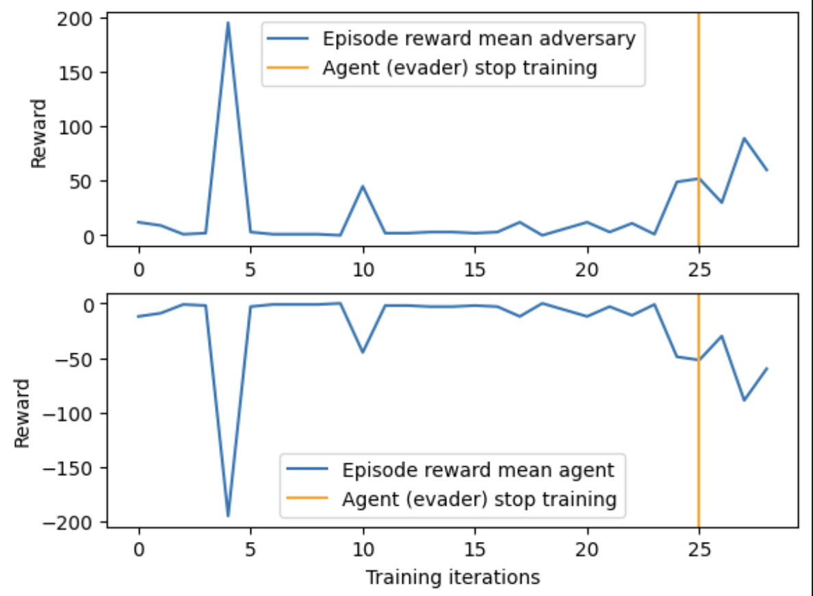
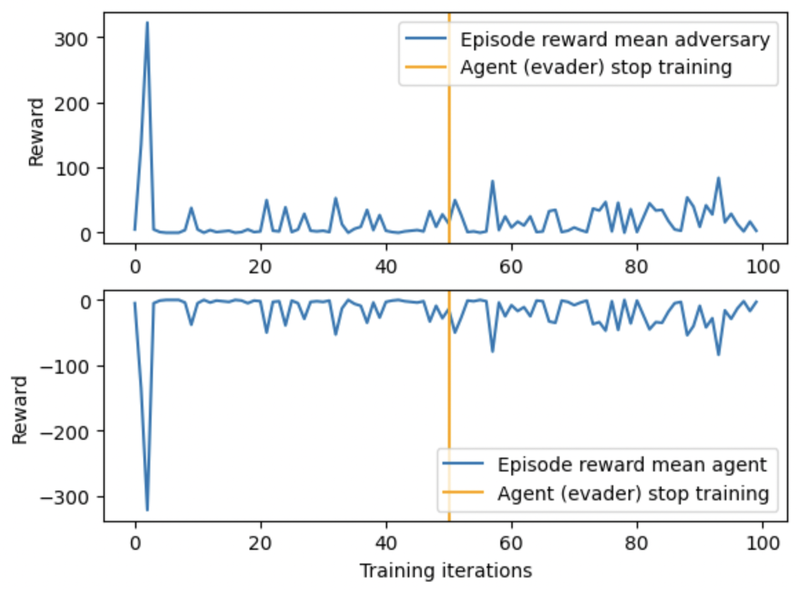
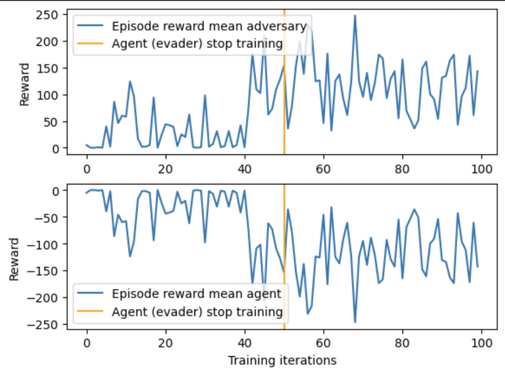
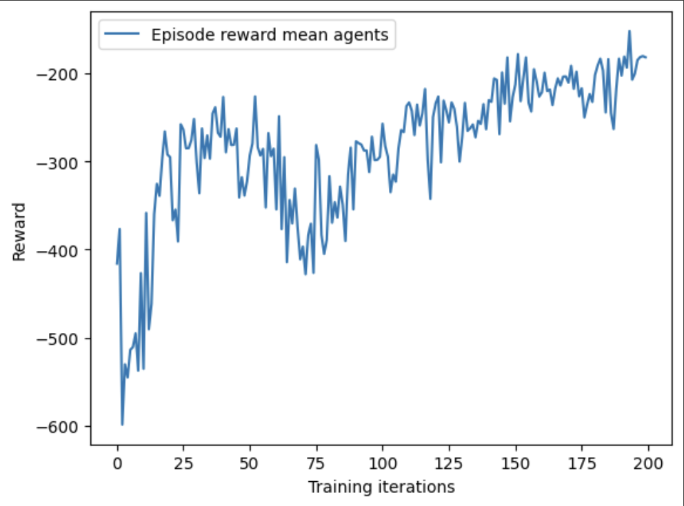
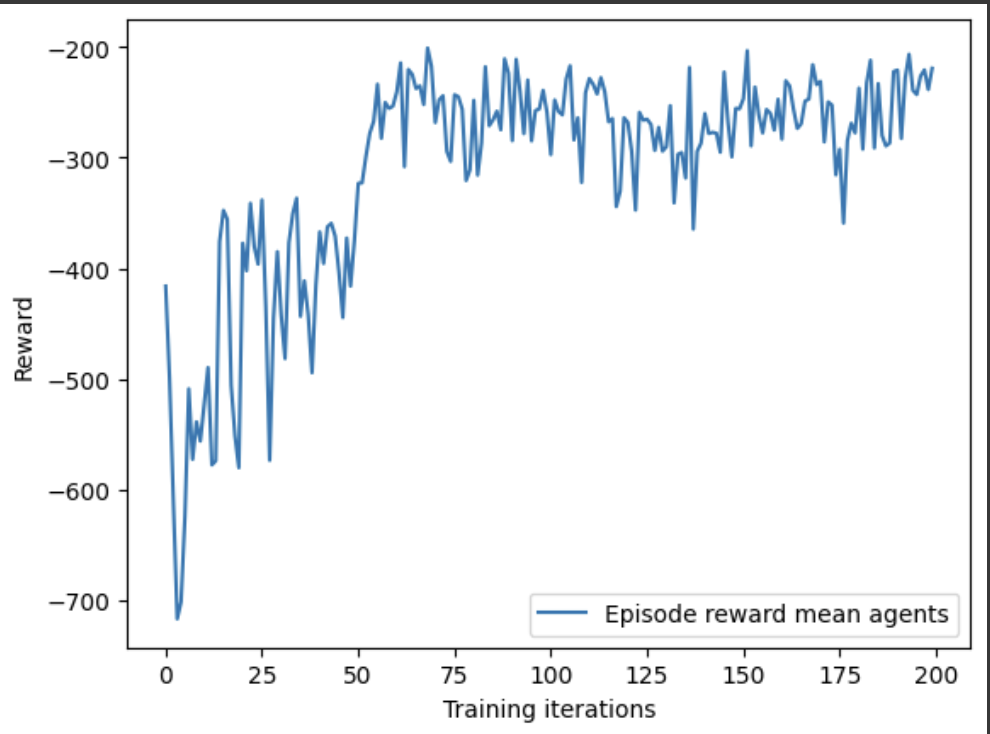
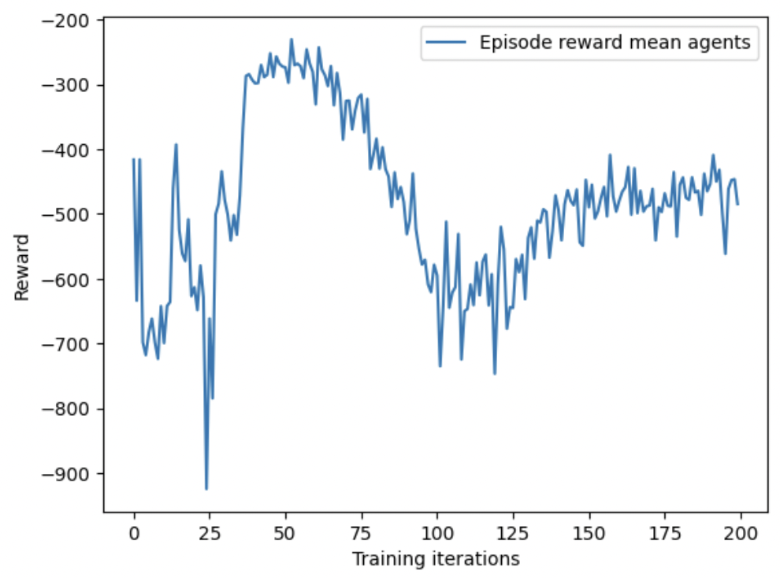
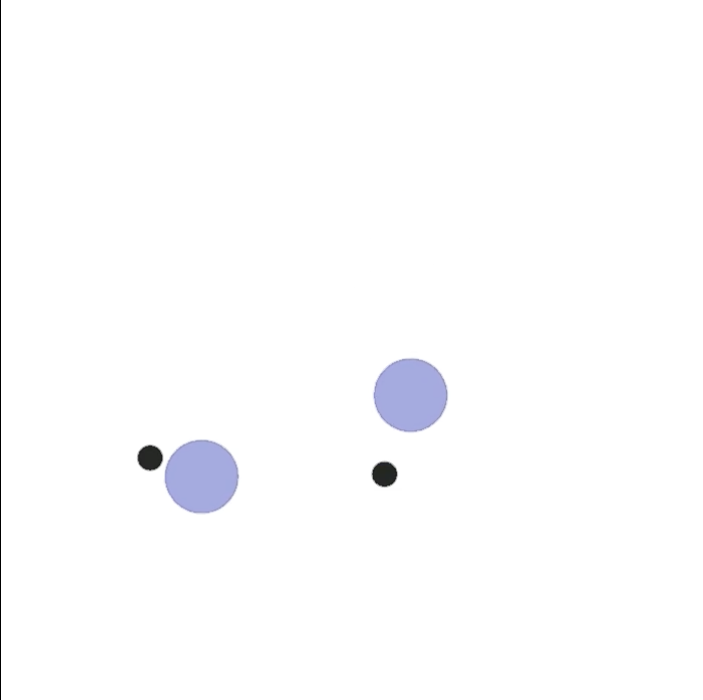
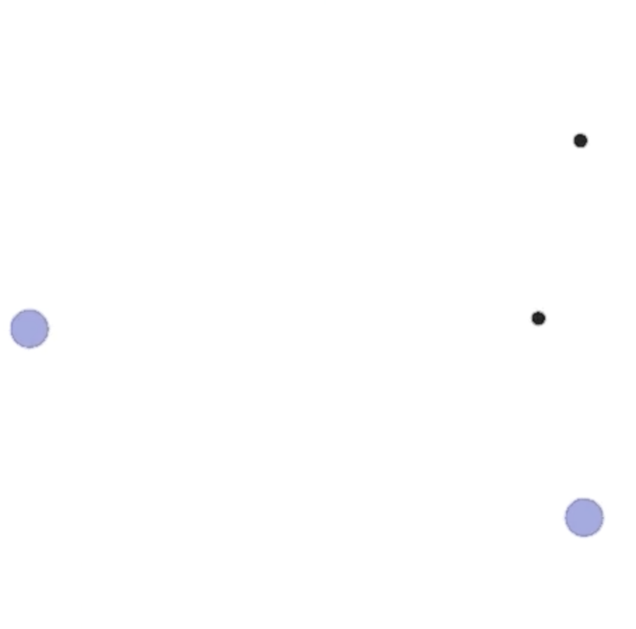

# Optimizing Decision-Making in Multi-Agent RL with CPT
### Sheyan Lalmohammed, Khush Gupta, Alok Shah
---

# Introduction
- Investigating Multi-Agent Reinforcement Learning (MARL) under Cumulative Prospect Theory (CPT)
- **Motivation:** Aligning autonomous agents with human decision-making biases
- **Key Questions:**
  - Do CPT-trained agents adhere to their utility and probability distortion functions?
  - How do CPT-guided agents optimize strategies in multi-agent games compared to those using traditional utility functions?
  - To what extent do agents adapt their strategies based on the utility functions of counterparties? What emergent dynamics arise in mixed populations of agents?

---

# Background on CPT - Prospect Theory
Developed by Daniel Kahneman and Amos Tversky in 1979, Prospect Theory explains decision-making under risk and uncertainty:
- **Loss Aversion:** People tend to avoid losses more than acquiring equivalent gains.
- **Relative Evaluation:** Decisions are made based on relative differences rather than absolute outcomes.
- **Reference-Dependent:** Evaluations are based on outcomes relative to a reference point.

---

# Background on CPT - Development of CPT
Cumulative Prospect Theory (CPT) extends the original framework to better handle multiple outcome probabilities:
- **Probability Weighting Function:** Captures the tendency to overweight small probabilities and underweight large probabilities.
- **Value Function:** Typically concave for gains and convex for losses, reflecting human risk preferences.

---

# Implementation Strategy
## Technical Approach & PyTorch Implementation
- **Policy Gradient Optimization with CPT:**
  - Integrates CPT-adjusted rewards and probability distortions.
  - Employs model-free learning using policy gradients.
- **Implementation Workflow:**
  1. Design a neural network for policy representation.
  2. Transform rewards using CPT functions.
  3. Compute policy gradients via automatic differentiation.
  4. Optimize policies using gradient ascent.

---

# CPT-Adjusted Rewards
**(1)**
$$
C(X) \;=\; \int_{-\infty}^0 w^+\bigl(P(u(X) > z)\bigr)\,dz \;-\; \int_{0}^{\infty} w^-\bigl(P(u(X) > z)\bigr)\,dz.
$$

**(2)**
$$
\max_{\pi \in \Pi_{M,N}} \; C\!\Bigl(\sum_{t=0}^{H-1} r_t\Bigr).
$$

- **$C$**: The CPT value capturing the decision-maker’s distortion in perceiving gains and losses.  
- **$\pi \in \Pi_{M,N}$**: A policy $\pi$ chosen from the set $\Pi_{M,N}$ (e.g., all feasible memory-based policies).

---

# Algorithms + Policy Gradient
Below is the Policy Gradient that we use to optimize the policy and solve our optimization problem.
$$
\nabla_{\rho} J 
\;=\; \mathbb{E}\Bigl[\,
  \xi\!\bigl(\textstyle \sum_{\tau} r_{\tau}\bigr)\,
  \nabla_{\rho}\,\mu_{\tau}\!\bigl(a_{\tau}\mid Q_{\tau}(s_{\tau},a_{\tau};n)\bigr)\,
  \nabla_{a_{\tau}}\,Q_{\tau}\!\bigl(s_{\tau},a_{\tau};n\bigr)
\Bigr].
$$

$$
\xi(V)
\;=\;
\int_{0}^{\max(V,0)} 
  w^+\!\Bigl(\,P\!\bigl(u\!\bigl(\textstyle \sum_{\tau} r_{\tau}\bigr) > z\bigr)\Bigr)
\,dz
\;-\;
\int_{0}^{\max(-V,0)}
  w^-\!\Bigl(\,P\!\bigl(u\!\bigl(\textstyle \sum_{\tau} r_{\tau}\bigr) > z\bigr)\Bigr)
\,dz.
$$

The algorithm we use is the Multi Agent Deep Deterministic Policy Gradient (MADDPG)

---
# Competitive Environment - Overview

PettingZoo's **Simple Tag** Environment is a basic Multi-Agent Particle Environment (MPE) designed for competition between agents

- **Objective**: Predators work to “tag” or catch the prey, while the prey’s goal is to evade capture.

- **Rewards**: Rewards are structured so that predators gain rewards when they successfully tag the prey, and the prey receives a penalty when caught.

---
# Competitive Environment - Rewards

<table style="">
  <tr>
    <td style="text-align:center;">
      <h3>Baseline</h3>
      
    </td>
    <td style="text-align:center;">
      <h3>Moderate CPT (Risk Seeking)</h3>
      
    </td>
    <td style="text-align:center;">
      <h3>Extreme CPT (Risk Averse)</h3>
      
    </td>
  </tr>
</table>

---
# Cooperative Environment - Overview

PettingZoo's **Simple Spread** Environment is a basic Multi-Agent Particle Environment (MPE) designed for semi-collaboration between agents

- **Objective**: The agents work cooperatively to cover all the landmarks. Their goal is to position themselves so that each landmark is “covered” by at least one agent, maximizing overall performance.

- **Rewards**: Rewards encourage efficient coverage of landmarks while also penalizing agents for collisions with one another, which promotes coordinated movement and spacing.

---

# Cooperative Environment - Rewards

<table style="">
  <tr>
    <td style="text-align:center;">
      <h3>Baseline</h3>
      
    </td>
    <td style="text-align:center;">
      <h3>Moderate CPT</h3>
      
    </td>
    <td style="text-align:center;">
      <h3>Extreme CPT</h3>
      
    </td>
  </tr>
</table>

---
## Cooperative Environment - Visualization of MPE

<table style="">
  <tr>
    <td style="text-align:center;">
      <h3>
        <a href="https://drive.google.com/file/d/1RUU4wajHfPnlRpBLjiiWhlRYVGbWxYG0/view?usp=sharing">
          Baseline CPT
        </a>
      </h3>
      
    </td>
    <td style="text-align:center;">
      <h3>
        <a href="https://drive.google.com/file/d/1GtPacyAr6v7q8w-zC1NBFHdQRRqFdXfP/view?usp=sharing">
          Extreme CPT
        </a>
      </h3>
      
    </td>
  </tr>
</table>

---

# Next Steps & Challenges
## **Planned Improvements**
- **Optimizing CPT Integration**
  - Attempt to try new probability weighting and value distortions
  - See the effect of new estimation methods for the value functions and integral
- **Implementing Discrete Competitive Environments**
  - Try the effect of the CPT-driven policy on an environment like Poker
  - Attempt to induce more interpretable CPT effects driven by Behavioral Economics Studies
---

# Conclusion

**Thank You! Questions?**