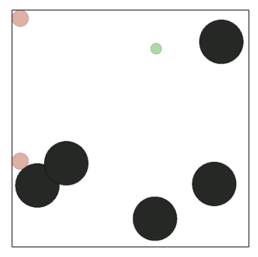

# Introduction
## **Optimizing Decision-Making in Multi-Agent RL with CPT**
- Investigating Multi-Agent Reinforcement Learning (MARL) under Cumulative Prospect Theory (CPT)
- Key motivation: **Aligning autonomous agents with human decision-making biases**
- Key Questions:
  - Do CPT trained agents work follow their utility and probability distortion functions?
  - How do CPT-guided agents optimize strategies in multi-agent games, and how do their behaviors differ from those using traditional utility functions?
  - To what extent do agents adapt their strategies based on the utility functions of counterparties? What emergent dynamics arise in mixed populations of agents?

---

# Background on CPT - Prospect Theory
Developed by Daniel Kahneman and Amos Tversky in 1979. Explains how people make decisions when faced with risk and uncertainty:
  - People tend to avoid losses over acquiring equivalent gains (loss aversion). 
  - People evaluate choices based on relative differences rather than absolute similarities. 
  - People think in terms of expected utility relative to a reference point.

---

# Background on CPT - Development of CPT
CPT provides a more robust framework for dealing with outcomes that have multiple possible probabilities, avoiding ranking issues and ensuring consistency in decision-making processes through nonlinear functions.
  - Probability weighting function - captures the empirical observation that people tend to overweight small probabilities and underweight large probabilities
  - Value function - concave for gains and convex for losses

---

# Implementation Strategy
## **Technical Approach & PyTorch Implementation**
- **Policy Gradient Optimization with CPT**
  - CPT-adjusted rewards & probability distortions
  - Model-free learning using policy gradients
- **Implementation Workflow**:
  1. Design neural network for policy representation
  2. Transform rewards using CPT functions
  3. Compute policy gradients using automatic differentiation
  4. Optimize policies using gradient ascent

---

# Mathematical Formulation

---
# Competitive Environment - Overview

PettingZoo's **Simple Tag** Environment is a basic Multi-Agent Particle Environment (MPE) designed for competition between agents

- **Objective**: Predators work to “tag” or catch the prey, while the prey’s goal is to evade capture.

- **Rewards**: Rewards are structured so that predators gain rewards when they successfully tag the prey, and the prey receives a penalty when caught.

---
# Competitive Environment - Rewards

<table style="">
  <tr>
    <td style="text-align:center;">
      <h3>Baseline</h3>
      
    </td>
    <td style="text-align:center;">
      <h3>Moderate CPT (Risk Seeking)</h3>
      
    </td>
    <td style="text-align:center;">
      <h3>Extreme CPT (Risk Averse)</h3>
      
    </td>
  </tr>
</table>

---
## Competitive Environment - Visualization of MPE

  <h3 style="margin: 0;">
    <a href="https://drive.google.com/file/d/1Qm2FBaRfO35JlgXCj_6ucN0n3-f4d8M6/view?usp=sharing">
      Extreme CPT
    </a>
  </h3>
  

---

# Cooperative Environment - Overview

PettingZoo's **Simple Spread** Environment is a basic Multi-Agent Particle Environment (MPE) designed for semi-collaboration between agents

- **Objective**: The agents work cooperatively to cover all the landmarks. Their goal is to position themselves so that each landmark is “covered” by at least one agent, maximizing overall performance.

- **Rewards**: Rewards encourage efficient coverage of landmarks while also penalizing agents for collisions with one another, which promotes coordinated movement and spacing.

---

# Cooperative Environment - Rewards

<table style="">
  <tr>
    <td style="text-align:center;">
      <h3>Baseline</h3>
      
    </td>
    <td style="text-align:center;">
      <h3>Moderate CPT</h3>
      
    </td>
    <td style="text-align:center;">
      <h3>Extreme CPT</h3>
      
    </td>
  </tr>
</table>

---
## Cooperative Environment - Visualization of MPE

<table style="">
  <tr>
    <td style="text-align:center;">
      <h3>
        <a href="https://drive.google.com/file/d/1RUU4wajHfPnlRpBLjiiWhlRYVGbWxYG0/view?usp=sharing">
          Baseline CPT
        </a>
      </h3>
      
    </td>
    <td style="text-align:center;">
      <h3>
        <a href="https://drive.google.com/file/d/1GtPacyAr6v7q8w-zC1NBFHdQRRqFdXfP/view?usp=sharing">
          Extreme CPT
        </a>
      </h3>
      
    </td>
  </tr>
</table>

---

# Next Steps & Challenges
## **Planned Improvements**
- **Optimizing CPT Integration**
  - Attempt to try new probability weighting and value distortions
  - See the effect of new estimation methods for the value functions and integral
- **Implementing Discrete Competitive Environments**
  - Try the effect of the CPT-driven policy on an environment like Poker
  - Attempt to induce more interpretable CPT effects driven by Behavioral Economics Studies
---

# Conclusion

**Thank You! Questions?**