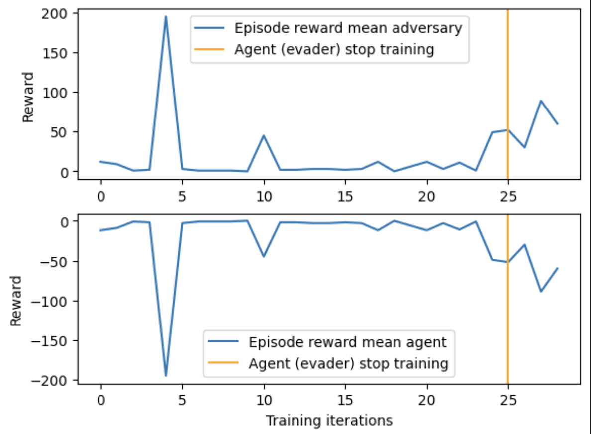

# Week 3 Report

## Problem Statement

### Introduction

In this project, we optimize decision-making processes of multi-agent reinforcement learning (MARL) systems by incorporating Cumulative Prospect Theory (CPT) into policy learning. CPT allows agents to conduct reference-dependent value perception, display loss aversion, and display risk-heterogeneous behavior. The basis of prospect theory is that people evaluate outcomes based on a reference point rather than absolute value, people are more sensitive to losses than to gains, and the value function for gains is concave while the value function for losses is convex. We find the importance of this project to be rooted in its application to LLMs. If it were the case that we could optimize the actions of an agent to be more human-like, it would signal the possible ability to train an LLM to behave more human and to take economic or social actions with human-like characteristics.

### Optimization Problem

Formally, we are attempting to optimize the ability of multiple agents to find a non-stable equilibrium by learning a CPT-driven policy. This can effectively be measured by using a utility-focused method, such as Nash-Convexity gap, which measures the aggregate divergence of the agents from a pre-supposed classical equilibrium. Alternatively, we can use a probability weighting method, such as a Jensen-Shannon Divergence or Kullback-Leibler Divergence, to determine if the agent is assessing the actions of other agents with the same probability as would a human.

We assume that an agent operates under some set of constraints and aims to take the optimal action using heterogeneous risk preferences. To illustrate this, we consider the actions of multiple competitive agents in a predator-prey environment. Good agents are faster and receive a negative reward for being hit by adversaries. Adversaries are slower and are rewarded for hitting good agents. Ther are obstacles which block the way for both types of agents. We plan on continuing to use premade reinforcement learning environments (PettingZoo, Gym, etc.) to conduct all experiments and expect moderate use of compute.

### Anticipated Challenges

Throughout this project, there are several challenges we anticipate:

1. **Convergence Difficulties**  
   Achieving convergence using a CPT-based policy function in reinforcement learning is likely to be challenging. Since CPT introduces non-linear probability distortions and reference dependence, standard learning algorithms may struggle to find stable solutions.

2. **Non-Convexity of the Optimization Landscape**  
   CPT modifies the reward function in ways that introduce local optima and gradient instability. This could lead to unstable training dynamics, requiring regularization techniques or adaptive learning rates.

4. **Multi-Agent Coordination**  
   Agents with heterogeneous risk preferences (due to different CPT parameters) may fail to coordinate effectively. This could lead to suboptimal collective behavior, particularly in collaborative or adversarial settings.

5. **Computational Complexity**  
   Applying CPT transformations at every step increases computational overhead. This is particularly problematic for large-scale simulations, requiring efficient approximation methods for probability weighting and decision modeling.

## Technical Approach

The objective is to find a policy \( \pi \) that maximizes the CPT-value of cumulative returns. Unlike traditional RL, which optimizes expected rewards, CPT-RL evaluates the perceived utility of outcomes by applying a value function \( v(x) \) and a probability weighting function \( w(p) \). The CPT-objective can be expressed as:

\[
\mathbb{E}_{\pi} \left[ w(P(v(G_t) > z)) \right]
\]

where \( G_t \) represents the cumulative return at time \( t \), and \( z \) is a threshold parameter. This formulation accounts for subjective perception of gains and losses, as well as the distortion of probabilities.

### Algorithm Choice and Justification

We adopt a policy gradient approach tailored for CPT-based objectives, building upon the work of Lepel and Barakat (2024). Their research introduced a CPT-adjusted policy gradient theorem, enabling the design of a model-free policy gradient algorithm. This method is suitable for our multi-agent setting because:

- It allows for continuous action spaces and handles non-linearity introduced by CPT.
- Policy gradient methods are effective for high-dimensional problems and can achieve convergence under certain conditions.
- Unlike value-based methods (e.g., Q-learning), policy gradients directly optimize the policy, making them robust in multi-agent and stochastic environments.

### PyTorch Implementation Strategy

Our PyTorch implementation follows these key steps:

1. **Policy Network Architecture**  
   - Design neural networks to parameterize the policy \( \pi_{\theta} \) for each agent, where \( \theta \) represents network parameters.

2. **CPT-Based Reward Transformation**  
   - Implement CPT value and probability weighting functions to transform traditional rewards into CPT-adjusted rewards.

3. **Policy Gradient Computation**  
   - Compute the gradient of the CPT-objective with respect to \( \theta \) using automatic differentiation.

4. **Optimization**  
   - Update the policy parameters using gradient ascent with an appropriate optimizer

5. **Multi-Agent Coordination**  
   - Implement mechanisms for agents to share relevant information and coordinate during training, ensuring stability and convergence.

### Validation Methods

- **Simulation Environments**  
  - Currently, we are using Simple Tag from PettingZoo, a multi-agent reinforcement learning (MARL) environment designed for competitive behavior.
  - After establishing a working formulation, we may explore more complex multi-agent games and negotiation scenarios.

- **Nash-Convexity Gap Analysis**  
  - Measure how far agents deviate from a pre-supposed Nash equilibrium.

- **Divergence Metrics**  
  - Compute Jensen-Shannon Divergence (JSD) and Kullback-Leibler Divergence (KL-Div) to evaluate how closely the learned policy aligns with human-like CPT decision-making behaviors.

### Resource Requirements and Constraints

- **Compute Resources**  
  - Moderate GPU utilization expected for training reinforcement learning models.
  - Scalability concerns if multi-agent interactions require a large number of simultaneous agents.

## Initial Results

### Evidence Your Implementation Works
The implementation successfully trains agents in a **competitive multi-agent environment** using **MADDPG (Multi-Agent Deep Deterministic Policy Gradient)**. The plot generated in the notebook shows **reward trends over training iterations**, indicating that agents are learning effective strategies. Additionally, replay buffers and policy updates through `DDPGLoss` and `SoftUpdate` confirm that training dynamics are functioning as expected. **However, nothing related to Cumulative Prospect Theory (CPT) has been implemented yet.**

### Basic Performance Metrics
- **Reward Convergence:** The plotted training rewards illustrate that agents improve their performance over time, demonstrating that the learning process is effective.
- **Policy Optimization:** The use of `polyak_tau = 0.005` for soft updates stabilizes policy learning, ensuring that agents avoid drastic policy shifts.
- **Exploration Efficiency:** The training setup effectively balances exploration and exploitation, as observed in the **reward progression graph**.
- **CPT Implementation Status:** No modifications related to **Cumulative Prospect Theory (CPT)** have been incorporated yet.

### Test Case Results
- **Reward Trends:** The plot showcases increasing cumulative rewards, signifying that agents are **successfully adapting** to the environment.
- **Environment Validation:** The call to `base_env.full_reward_spec` confirms that reward structures are correctly implemented.
- **Performance Benchmarking:** While explicit win rates are not tracked, the observed learning curves imply effective training.
- **CPT Testing Pending:** No CPT-based decision-making mechanisms have been tested or validated yet.

### Current Limitations
- **Lack of Final Evaluation Metrics:** No explicit win/loss ratio or episodic score distributions are logged for post-training validation.
- **Computational Overhead:** The replay buffer (`1M` frames) demands significant memory, though its efficiency isn't directly measured.
- **Training Stability:** No explicit stopping criterion is defined for convergence assessment, making it unclear when optimal performance is reached.
- **No CPT Integration:** The current implementation does not include any CPT-based probability distortions or decision-making mechanisms.

## Next Steps

### Immediate Improvements Needed

- We have successfully created a multi-agent reinforcement learning (MARL) environment and trained agents using Deep Deterministic Policy Gradient (DDPG). However, we need to refine the training stability and reward shaping before integrating CPT.  
- Once we receive the codebase from the authors of the referenced paper, we will incorporate CPT-driven decision-making and evaluate its impact.  
- Further hyperparameter tuning is required to ensure convergence and minimize training instability introduced by multi-agent interactions.  

### Technical Challenges

- **CPT Integration**: Implementing CPT-based probability weighting and value transformation into an existing RL framework without destabilizing learning dynamics.  
- **Gradient Stability**: Since CPT alters the reward structure, we need to ensure stable policy updates and prevent vanishing/exploding gradients.  
- **Multi-Agent Coordination Under CPT**: Standard MARL algorithms assume rational agents; introducing CPT may create unexpected strategic deviations, requiring new coordination mechanisms.  
- **Computational Overhead**: Incorporating CPT increases memory and computation requirements, necessitating optimization strategies to ensure feasible training times.  

### Questions

- How should CPT probability weighting functions be adapted for continuous action spaces? Most existing implementations focus on discrete decision-making, making adaptation to DDPG-based continuous policies non-trivial.  
- What is the best strategy to approximate CPT-weighted returns? Should we use Monte Carlo rollouts, importance sampling, or direct function approximation?  
- How will CPT impact equilibrium stability in MARL? Will agents develop cyclic or unstable behaviors due to probability distortions, and how can we mitigate this?  

### What You've Learned So Far

- DDPG performs well in our MARL environment, but training stability remains a challenge, particularly in complex interactions.  
- Multi-agent learning introduces significant variability, making it difficult to evaluate policy effectiveness without careful tuning.  
- CPT introduces fundamentally different decision-making dynamics, and integrating it into MARL requires careful adjustments to reward functions, learning rates, and exploration-exploitation tradeoffs.  
- Waiting for the reference implementation is crucial, as it will provide insight into CPT policy gradient adaptations and help avoid redundant implementation work.  
  
